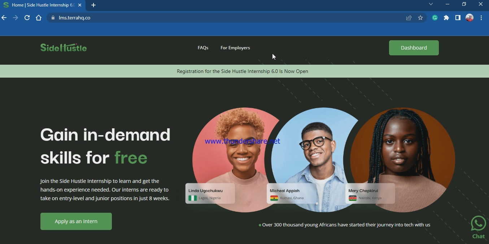
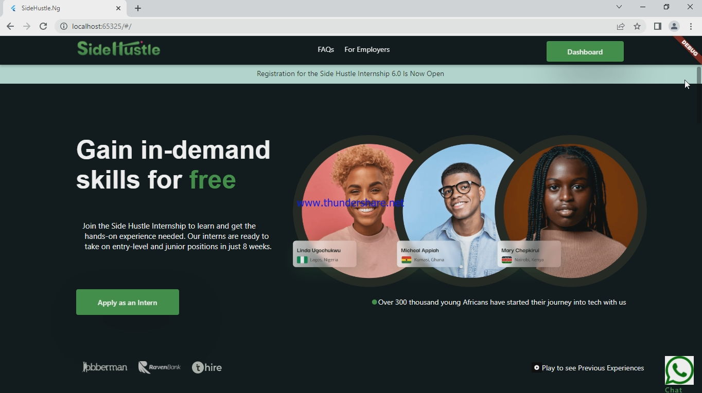

# sidehustle_site

A new Flutter project.

## Getting Started

This project is a starting point for a Flutter application in which the aim was to recreate the Landing page of the Company I worked as an itern.

This repository is also meant to practice and implement what have been taught to us such as;
### Designing Beautiful UI 
### Managing the state of our app when the code gets bulky by extracting our widgets into separate folder

## Screen of original site 
- 

## Screen of the code output
- 
